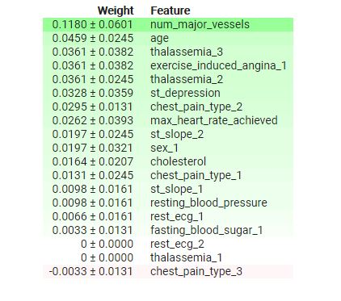
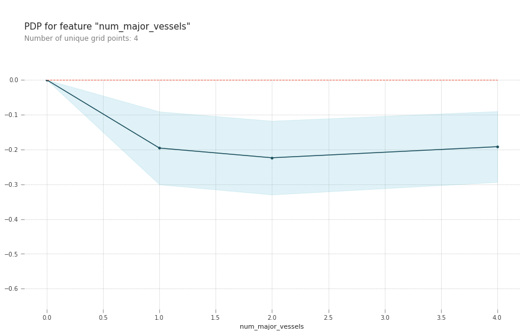
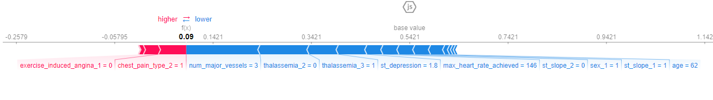

# heart-disease-diagnosis

  

## Description

Heart-disease-diagnosis is a jupyter notebook that utilizes Random Forest Classifier model to effectively determine the existence of a heart disease using a patient dataset that contains 14 different attributes for 303 different patients. By preprocessing the heart disease dataset and utilizing several classification algorithms, I was able to build a model that achieved **87% accuracy rate**. To process large sets of data efficiently, I decided to use Google Colab, which allowed me to utilize its GPUs and memory space. However, since the dataset for this notebook is not significantly large, one does not necessarily have to use Colab. The dataset used for this notebook was acquired from [Kaggle](https://www.kaggle.com/ronitf/heart-disease-uci).

The general process for the notebook was:

1. Import all necessary packages
2. Attain dataset from Kaggle
3. Understand the Dataset
4. Data Exploration and Visualization
5. Data Preprocessing
6. Model Creation
7. Model Evaluation
8. Model Analysis

The main objective of this notebook was to explore the model analysis techniques like Permutation Importance, Partial Dependence Plots, and Shapely Additive Explanations. Rather than blindly believing the model created by machine learning algorithms (SVM, Random Forest, etc), it would be much more helpful for the readers to see how specific features affect the model.

## Figures and Charts

Permutation Importance

Partial Dependence Plots

SHAP Values

